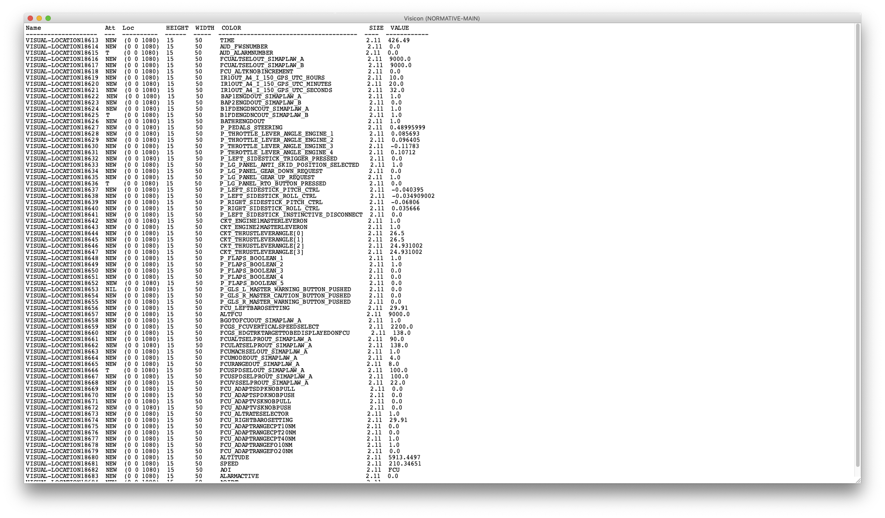

# ActCV - python interface

[](https://travis-ci.org/seblum/ActCV)

This is a library for connecting the ACT-R visicon with user data.

The cognitive architecture ACT-R is able to monitor a human operator’s interactions with a system using the concept of model-tracing, a concept previously implemented within an ACT-R tutoring system [1]. This software library translated and adapted the work of [2] to establish such a connection between the programming language python and ACT-R version 7.12.

[1] <cite> Fu, W.-T., Bothell, D., Douglass, S., Haimson, C., Sohn, M.-H., & Anderson, J. (2006). Toward a real-time model-based training system. Interacting with Computers, 18(6), 1215–1241. </cite> 

[2] <cite> Halbruegge, M. (2013). Act-cv - bridging the gap between cognitive models and the outer world. In E. Brandenburg (Ed.), Grundlagen und Anwendungen der Mensch- Maschine- Interaktion: 10. Berliner Werkstatt Mensch- Maschine-Systeme (pp. 205–210). Berlin: TU Berlin. </cite> 




## Installation

```bash
pip install git+https://github.com/seblum/actcv
```


## Quick-Start

Take a look at the [examples](examples) folder for an exemplary use case.

```python

import pandas as pd

import actr
import actcv as cv

data = pd.read_csv('userData.csv', sep = ';', dtype = {'alarmactivecolumn' : float, 'alarmnumbercolumn' : float, 'timecolumn' : float})

header = list(data)
data = data.where((pd.notnull(data)), None)
       
frequency = 3000
duration = 3
starttime = 0
indexinput = 0
timebreak = 0.1

cv.init_actcv()
cv.schedule_Visicon(data, header, 'alarmactivecolumn', 'alarmnumbercolumn', 'timecolumn', 
					frequency, duration, starttime, indexinput, timebreak)

actr.run()

```

## Files

- **actcv.py** - Contains the interface of ACT-CV and methods to load a user data set into the visicon of ACT-R.

- **actr.py** - Contains the dispatcher of ACT-R version 7.12., which is necessary to form a connection between python and ACT-R.


## TODO
Possible additional feature to add:

- [ ] Add more dynamic read in for data
- [ ] Add debugging support 
